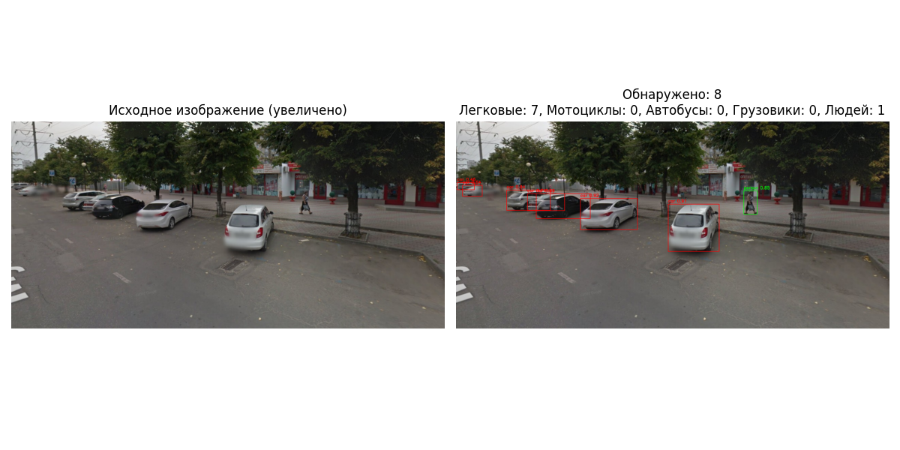

# Счетчик автомобилей и людей на изображениях

Эта программа автоматически определяет и подсчитывает автомобили и людей на фотографиях, аэрофото и спутниковых снимках с помощью нейросети YOLOv8. Результаты визуализируются в виде графического окна с исходным и обработанным изображением.

## Возможности
- Подсчет легковых автомобилей, мотоциклов, автобусов, грузовиков
- (Опционально) Подсчет людей (если включено в коде)
- Визуализация: исходное и обработанное изображение с рамками и подписями
- Графический выбор изображения через диалоговое окно
- Поддержка больших и мелких объектов (используется модель yolov8x)

## Как запустить

1. **Клонируйте репозиторий:**
   ```bash
   git clone https://github.com/pavpl/Car-Counter
   cd Car-Counter
   ```
2. **Установите зависимости:**
   ```bash
   pip install -r requirements.txt
   ```
3. **Запустите программу:**
   ```bash
   python car_counter.py
   ```
4. **Выберите изображение** через появившееся окно. Дождитесь появления результатов.

## Пример работы

Исходное и обработанное изображение будут показаны рядом. На обработанном изображении все найденные автомобили обведены красными рамками, а (если включено) люди — зелёными. В заголовке указано количество объектов каждого типа.

### Пример 1



### Пример 2


## Примечания
- Для лучшей точности используется модель yolov8x (скачивается автоматически при первом запуске)
- Программа работает с изображениями в форматах JPG, PNG, BMP и др.
- Для обработки спутниковых снимков и аэрофото рекомендуется использовать изображения хорошего качества
- Если требуется учитывать людей, раскомментируйте соответствующие строки в коде (или используйте версию с поддержкой людей)

---

**Автор:** [Ваше имя или ник] 